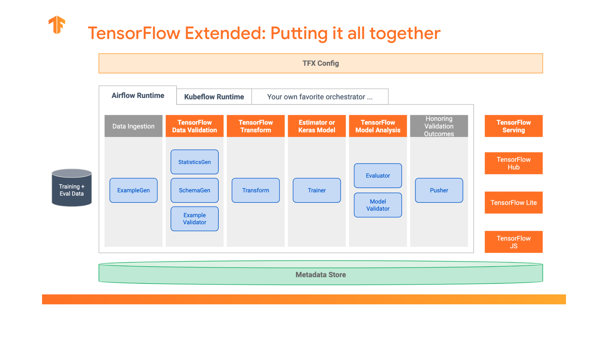

# Tensorflow

- [Tensorflow](#tensorflow)
  - [Introduction to Tensorflow](#introduction-to-tensorflow)
    - [Tensorflow 2.0](#tensorflow-20)
      - [Core Modules](#core-modules)
        - [tf.keras](#tfkeras)
        - [tf.data](#tfdata)
        - [tf.distribute](#tfdistribute)
        - [saved model](#saved-model)
  - [Basics](#basics)
      - [Graph](#graph)
      - [Session](#session)
      - [Tensor](#tensor)
      - [Inputs](#inputs)
      - [Operations](#operations)
      - [Saver](#saver)
      - [Built-In Optimizers](#built-in-optimizers)
- [Keras](#keras)
    - [Common functions](#common-functions)
      - [layers](#layers)
      - [Utilities](#utilities)
  - [Reference](#reference)
  
## Introduction to Tensorflow

- Tensorflow Modules and APIs
  - Python, C++, Go, Java supported
- a **declarative** language \(vs. imperative\)
  - use functions to express mathematical modules, use functions as computation units
- a graph-based computation model

Deep Learning Applications

- Internet
  - autorecommendation \(ad, music\)
    - new vs old banner
    - persona
    - [贝壳找房](https://new.qq.com/omn/20191031/20191031A04VIO00.html)
    - [QQ音乐](https://zhuanlan.zhihu.com/p/28310437)
  - OCR
  - photo labels
  - edge detection
    - [Tecent](https://blog.csdn.net/jilrvrtrc/article/details/106368358)
  - video segmentation
  - speech detection
- Machine Translation
- Face Recognition
- Scientific Research
  - patten recognition \(eg. astronomy\)
- System Engineering
  - auto parameter tuning
- Agriculture
  - cow and pig
- medical and clinic

### Tensorflow 2.0

Upgraded from Tensorflow 1.0, TF2.0

- Simplified language concepts
  - TF 1.0 is full of abstract notions and lower-level APIs
  - TF 2.0 hides many lower level APIs and standardized the TF as a infrastructure
- Integrates different powerful enviroments and tools
  - Python
    - Eager Execution fully integrated with python features
  - Numpy
  - Keras
  - PyTorch
    - Dynamic Graph features based on Eager Execution
- Ecosystem development
  - Tensorflow Lite
  - Tensorflow.js
  - Tensorboard
  - Tensorflow Quantum
  - Tensorflow Hub
  - Tensorflow Extended



#### Core Modules


##### tf.keras

- high level API
- supports SavedModel
- Eager Execution
- Distributed Training

##### tf.data

supports

- data source
  - file system, distributed file system, object storage
- data format
    - csv, graph, txt
    - Numpy Array, python generator, TFRecord
- data preprocessing
  - graph decoding
  - Shffle
  - py_function
  - resampling

##### [tf.distribute](https://www.tensorflow.org/api_docs/python/tf/distribute)

##### saved model

- use Protobuff for seralization
- supports training and deployment


---

## Basics

#### Graph

- Tensorflow create a default graph after importing, all operations will go there by default
  - _tf.get\_default\_graph\(\)_
- You can create own graph and get operations there
  - ```py
    g = tf.Graph()
    with g.as_default():
        pass
    ```
- _tf.rest\_default\_graph\(\)_
- edges 
  - tensors/sparse tensors
- nodes
  - **operations **- computation
  - **variable **- storage
  - **constant **- placeholders

#### Session

- tf.session\(\[target=\], \[graph=\], \[config=\]\) object encapsulates the **environment*- in which tf.Operation objects are executed and tf.Tensor objects are evaluated
  - target is execution engine, graph is data flow graph, config is start config
  - _sess.run\(&lt;graph&gt;, \[feed\_dict\]\)_
- \_tf.InteractiveSession\(\) - \_create a session, definitions follow
  - _&lt;graph&gt;.run\(\) _- run the graph
- with tf.Session\(\) as sess:
  - _tf.global\_variable\_initilalizer\(\).run_
    - or s.run\(global vairbale initializer\(\)\)
  - &lt;variable&gt;.eval
- 3 Steps when a session runs
  - get tensors
  - evaluate tensors - tensor.eval, operation.run
  - run session - session.run
- Tensorflow will automatically execute sub-graphs in typological order and distribute computations in different **devices**\(per cpu/gpu/tpu\)
  - nodes - can assign nodes to run on different devices
    - _with tf.device\(&lt;device&gt;\) _- will run on a certain device
  - client -server: the actual execution is the client sends the graph to the server \(C++\) and server distributes to workers

#### Tensor

Basic datatype is tensorflow

#### Inputs

- _tf.placeholder\(&lt;tf datatype&gt;, \(shape\)\)_
  - data type like tf.float32
- _tf.Variable_
  - _tf.get\_variable\(&lt;name&gt;, &lt;shape=&gt;, &lt;dtype=&gt;\)_
  - is a special type of operations, returns a **tensor**
- _tf.constant\(&lt;value&gt;\)_

#### Operations

tf.

- @ - tf.matmul\(\)
- Arithmetic
  - _add/multiply/mod/sin/sqrt/fft/argmin_
- Aggregation
  - reduce\_mean\(x, \[dim\]\)
- List
  - _size/rank/split/reverse/cast/one\_hot/quantize_
- Gradient
  - _clip\_by\_value, clip\_by\_norm, clip\_by\_global\_norm_
- Logical
  - _identity/logical\_and/equal/less/is\_finite/is\_nan_
- Dataflow
  - _enqueue/dequeue/size/take\_gard/apply\_grad_
- Initialization
  - _zeros\_initializer/random\_normal\_initializer/orthogonal\_initializer_
- Neural Network
  - _convolution/pool/bias\_add/softmax/dropout/erosion2d_
  - nn
    - loss functions
    - activation functions
      - sigmoid, softmax
- Layers
  - dense
- Random
  - _random\_normal/random\_shuffle/multinomial/random\_gamma_
- String
  - _string\_to\_hash\_bucket/reduce\_join/substr/encode\_base64_
- Image
  - _encode\_png/resize\_images/rot90/rot90/hsv\_to\_rgb/adjust/gamma_

&lt;variable&gt;.

- _assign_
- _assign\_add_

#### Saver

- [tf.saved\_model.simple\_save](https://www.tensorflow.org/versions/r1.15/api_docs/python/tf/saved_model/simple_save)
- [tf.saved\_model.load](https://www.tensorflow.org/api_docs/python/tf/saved_model/load)

#### Built-In Optimizers

tf.train


To use optimizers

- compute\_gradients
- operations on gradients \(eg. clip, weighted\)
- apply\_gradients: apply to variables

or, use optmizer.minimize\(loss, global\_step\) directly

---

# Keras

Provides higher level APIs then the Tensorflow. Support key functionalities to build neural networks fast, [work together with Tensorflow](https://blog.keras.io/keras-as-a-simplified-interface-to-tensorflow-tutorial.html)

### Common functions

model.

- add\(\)
  - add layers
- compile\(\)
- fit\(\)
- save\(\)

model types

- model  = Sequential\(\)

#### layers

from keras import layers

- [Dropout](https://keras.io/layers/core/#dropout): applies dropout
- [Dense](#): fully-connected layer.
- [Flatten](https://keras.io/layers/core/#flatten): flattens the input, does not affect the batch size.
- [Activation](https://keras.io/layers/core/#activation): applies an activation function.
- [LeakyReLU](#): applies leaky relu activation.
- [Conv2D](https://keras.io/layers/convolutional/#conv2d): convolution layer 
  - **filters **: number of output channels;
  - **kernel\_size **: an integer or tuple/list of 2 integers, specifying the width and height of the 2D convolution window;
  - **padding**: padding="same" adds zero padding to the input, so that the output has the same width and height, padding='valid' performs convolution only in locations where kernel and the input fully overlap;
  - **activation**: "relu", "tanh", etc.
  - **input\_shape**: shape of input.
- [MaxPooling2D](https://keras.io/layers/pooling/#maxpooling2d): performs 2D max pooling.

#### Utilities 

Used for data processing

[keras.utils](https://scikit-learn.org/stable/modules/classes.html)

- to\_categorical\(y, num\_classes= None, dtype='float32'\)

## Reference

- [Tensorflow Tutorials](https://www.tensorflow.org/tutorials)
- [Tensorflow-Examples](https://github.com/aymericdamien/TensorFlow-Examples?spm=a2c6h.12873639.0.0.fa5c6e6aR0vjfW)
- [Tensorflow快速入门与实战](https://github.com/geektime-geekbang/tensorflow-101)