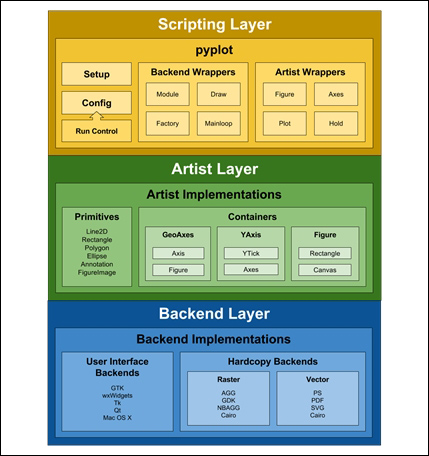

# Visualization

- [Visualization](#visualization)
  - [Matplotlib](#matplotlib)
    - [Basic](#basic)
      - [Matplotlib Object Layers](#matplotlib-object-layers)
      - [Colors and Styles (Attributes control)](#colors-and-styles-attributes-control)
      - [Ax vs Plt](#ax-vs-plt)
      - [Basic Plots](#basic-plots)
    - [Legends](#legends)
    - [Color bars](#color-bars)
      - [Color maps](#color-maps)
      - [Color limits and Bars](#color-limits-and-bars)
    - [Subplots](#subplots)
    - [Text and Annotation (Locator and Formater)](#text-and-annotation-locator-and-formater)
    - [Cutimizing Ticks](#cutimizing-ticks)
    - [Configurations and StyleSheets](#configurations-and-stylesheets)
      - [Plt.rc](#pltrc)
      - [StyleSheets](#stylesheets)
    - [Three-dimensional Plotting](#three-dimensional-plotting)
    - [MatplotLib_Utils](#matplotlib_utils)
  - [Pandas Ploting](#pandas-ploting)
  - [Seaborn](#seaborn)
    - [Replot (relational plot)](#replot-relational-plot)
    - [Distplot (distribution plots)](#distplot-distribution-plots)
  - [Catplot (Categorical)](#catplot-categorical)
  - [Other Useful Visualization Libaries](#other-useful-visualization-libaries)
    - [PyLab](#pylab)
    - [Boken](#boken)
    - [Plotly](#plotly)

## Matplotlib

### Basic

```py
# use in notebook: the output is displayed inline in notebook
%matplotlib inline
# %matplotlib notebook : interactive
import matplotlib.pyplot as plt
# set style
plt.style.use('seaborn-whitegrid')
import numpy as np
```

- plt.style
  - [sns styles](http://seaborn.pydata.org/tutorial/aesthetics.html)

#### Matplotlib Object Layers



```py
fig = plt.figure()
ax = plt.axes()

x = np.linspace(0, 10, 1000)
ax.plot(x, np.sin(x)) # alternatively, use plt.plot(x, np.sin(x));
```

- the figure (an instance of the class plt.Figure) can be thought of as a single container that contains all the objects representing axes, graphics, text, and labels.
- The axes (an instance of the class plt.Axes) : a bounding box with ticks and labels, which will eventually contain the plot elements that make up our visualization.

#### Colors and Styles (Attributes control)

- [color](https://matplotlib.org/3.5.0/gallery/color/named_colors.html)
- [cmap](https://matplotlib.org/3.5.1/tutorials/colors/colormaps.html)
- [linestyle](https://matplotlib.org/3.5.1/gallery/lines_bars_and_markers/linestyles.html)
- plt.xlim(), plt.ylim
- [plt.axis](https://matplotlib.org/3.5.0/api/_as_gen/matplotlib.pyplot.axis.html)
  - 'tight', 'equal', ...
- plt.title(), .xlabel(),.ylabel(), .legend

#### Ax vs Plt

Most plt functions translate directly to ax method, few exceptions

- plt.xlabel() → ax.set_xlabel()
- plt.ylabel() → ax.set_ylabel()
- plt.xlim() → ax.set_xlim()
- plt.ylim() → ax.set_ylim()
- plt.title() → ax.set_title()
  
use ax.set() method

```py
ax = plt.axes()
ax.plot(x, np.sin(x))
ax.set(xlim=(0, 10), ylim=(-2, 2),
       xlabel='x', ylabel='sin(x)',
       title='A Simple Plot');
```

#### Basic Plots

plt.plot(x1,y1,x2,y2..., attributes controls ...)

- attributes control
  - type
  - [markers](https://matplotlib.org/3.5.1/gallery/lines_bars_and_markers/marker_reference.html)
    - markersize, linewidth, markerfacecolor, markeredgecolor, markeredgewidth, etc

other kinds of plots

- plt.scatter
- plt.hist
  - plt.hist2d, plt.hexbin
- plt.bar
- plt.errorbar(x, y, yerr, fmt, color, eclor, elinewidth, capsize)
- plt.fill_between(x, ydown, yup, color, alpha = )
- plt.contor(X, Y, Z, colors = )
- [plt.imshow](https://matplotlib.org/3.5.0/api/_as_gen/matplotlib.pyplot.imshow.html)

Other key functions

- plt.gca() - set axes
  - .setx_lim(), .set_ylim()
- plt.figure(figsize)

### Legends

- ax.legend()
  - loc
  - frameon
  - ncol
  - borderpad, fancybox
- plt.legend(vals, legneds)
- plt.colorbar

label points on a graph

```py
import pandas as pd
cities = pd.read_csv('data/california_cities.csv')

# Extract the data we're interested in
lat, lon = cities['latd'], cities['longd']
population, area = cities['population_total'], cities['area_total_km2']

# Scatter the points, using size and color but no label
plt.scatter(lon, lat, label=None,
            c=np.log10(population), cmap='viridis',
            s=area, linewidth=0, alpha=0.5)
plt.axis(aspect='equal')
plt.xlabel('longitude')
plt.ylabel('latitude')
plt.colorbar(label='log$_{10}$(population)')
plt.clim(3, 7)

# Here we create a legend:
# we'll plot empty lists with the desired size and label
for area in [100, 300, 500]:
    plt.scatter([], [], c='k', alpha=0.3, s=area,
                label=str(area) + ' km$^2$')
plt.legend(scatterpoints=1, frameon=False, labelspacing=1, title='City Area')

plt.title('California Cities: Area and Population');
```

multiple legends

creating a new legend artist from scratch, and then using the lower-level ax.add_artist() method to manually add the second artist to the plot:

```py
fig, ax = plt.subplots()

lines = []
styles = ['-', '--', '-.', ':']
x = np.linspace(0, 10, 1000)

for i in range(4):
    lines += ax.plot(x, np.sin(x - i * np.pi / 2),
                     styles[i], color='black')
ax.axis('equal')

# specify the lines and labels of the first legend
ax.legend(lines[:2], ['line A', 'line B'],
          loc='upper right', frameon=False)

# Create the second legend and add the artist manually.
from matplotlib.legend import Legend
leg = Legend(ax, lines[2:], ['line C', 'line D'],
             loc='lower right', frameon=False)
ax.add_artist(leg)

```

### Color bars

#### [Color maps](https://matplotlib.org/3.5.1/tutorials/colors/colormaps.html)

A full treatment of color choice within visualization is beyond the scope of this book, but for entertaining reading on this subject and others, see the article ["Ten Simple Rules for Better Figures](http://journals.plos.org/ploscompbiol/article?id=10.1371/journal.pcbi.1003833)". Matplotlib's online documentation also has an [interesting discussion](http://matplotlib.org/1.4.1/users/colormaps.html) of colormap choice.

Broadly, you should be aware of three different categories of colormaps:

- Sequential colormaps: These are made up of one continuous sequence of colors (e.g., binary or viridis).
- Divergent colormaps: These usually contain two distinct colors, which show positive and negative deviations from a mean (e.g., RdBu or PuOr).
- Qualitative colormaps: these mix colors with no particular sequence (e.g., rainbow or jet).

#### Color limits and Bars

we can narrow the color limits and indicate the out-of-bounds values with a triangular arrow at the top and bottom by setting the extend property.

Discerete Color bars: pass a number of bins to plt.cm.get_cmap

```py
plt.imshow(I, cmap=plt.cm.get_cmap('Blues', 6))
plt.colorbar()
plt.clim(-1, 1)
```

### Subplots

- use plt.axes to create subplots by hand

```py
ax1 = plt.axes()  # standard axes
ax2 = plt.axes([0.65, 0.65, 0.2, 0.2])

# altenratively
fig = plt.figure()
ax1 = fig.add_axes([0.1, 0.5, 0.8, 0.4],
                   xticklabels=[], ylim=(-1.2, 1.2))
ax2 = fig.add_axes([0.1, 0.1, 0.8, 0.4],
                   ylim=(-1.2, 1.2))

```

- plt.subplot(nrow, ncol, \<order number\>,  [color, maker..])

```py
fig = plt.figure()
fig.subplots_adjust(hspace=0.4, wspace=0.4)
for i in range(1, 7):
    ax = fig.add_subplot(2, 3, i)
    ax.text(0.5, 0.5, str((2, 3, i)),
           fontsize=18, ha='center')
```

- plot.subplots
  - this function creates a full grid of subplots in a single line, returning them in a NumPy array.

```py
fig, ax = plt.subplots(2, 3, sharex='col', sharey='row')
# axes are in a two-dimensional array, indexed by [row, col]
for i in range(2):
    for j in range(3):
        ax[i, j].text(0.5, 0.5, str((i, j)),
                      fontsize=18, ha='center')
fig
```

- plt.GridSpec
  - To Go beyond a regular grid to subplots that span multiple rows and columns, plt.GridSpec() is the best tool. The plt.GridSpec() object does not create a plot by itself; it is simply a convenient interface that is recognized by the plt.subplot() command

```py
grid = plt.GridSpec(2, 3, wspace=0.4, hspace=0.3)
plt.subplot(grid[0, 0])
plt.subplot(grid[0, 1:])
plt.subplot(grid[1, :2])
plt.subplot(grid[1, 2])

# or use fig.add_subplot(grid[:]) for plotting

```

### Text and Annotation (Locator and Formater)

- ax.text(x, y, label, ha, \*\*style)
  - See the docstring of plt.text() and of mpl.text.Text()
  - transform =
    - ax.transData: Transform associated with data coordinates
    - ax.transAxes: Transform associated with the axes (in units of axes dimensions)
    - fig.transFigure: Transform associated with the figure (in units of figure dimensions)
- ax.set_xlim, .set_ylim
- [ax.annotate](https://matplotlib.org/stable/api/_as_gen/matplotlib.pyplot.annotate.html)(text, xy, xytext, arrowprops)

### Cutimizing Ticks

These tick properties—locations and labels—that is, can be customized by setting the formatter and locator objects of each axis.

- ax.xaxis.
  - set_major_locator
  - set_minor_locator
  - set_major_formatter
- locator objects(from [Matplotlib.ticker](https://matplotlib.org/stable/api/ticker_api.html))
  - NullLocator
    - No ticks
  - FixedLocator
    - Tick locations are fixed
  - IndexLocator
    - Locator for index plots (e.g., where x = range(len(y)))
  - LinearLocator
    - Evenly spaced ticks from min to max
  - LogLocator
    - Logarithmically ticks from min to max
  - MultipleLocator
    - Ticks and range are a multiple of base
  - MaxNLocator
    - Finds up to a max number of ticks at nice locations
  - AutoLocator
    - (Default.) MaxNLocator with simple defaults.
  - AutoMinorLocator
    - Locator for minor ticks
- Format Class
  - Formatter Class Description
  - NullFormatter
    - No labels on the ticks
  - IndexFormatter
    - Set the strings from a list of labels
  - FixedFormatter
    - Set the strings manually for the labels
  - FuncFormatter
    - User-defined function sets the labels
  - FormatStrFormatter
    - Use a format string for each value
  - ScalarFormatter (Default.)
    - Formatter for scalar values
  - LogFormatter
    - Default formatter for log axes

### Configurations and StyleSheets

#### Plt.rc

Each time Matplotlib loads, it defines a runtime configuration (rc) containing the default styles for every plot element you create. it can by set by **plt.rc()** method

```py
from matplotlib import cycler
colors = cycler('color',
                ['#EE6666', '#3388BB', '#9988DD',
                 '#EECC55', '#88BB44', '#FFBBBB'])
plt.rc('axes', facecolor='#E6E6E6', edgecolor='none',
       axisbelow=True, grid=True, prop_cycle=colors)
plt.rc('grid', color='w', linestyle='solid')
plt.rc('xtick', direction='out', color='gray')
plt.rc('ytick', direction='out', color='gray')
plt.rc('patch', edgecolor='#E6E6E6')
plt.rc('lines', linewidth=2)
```

#### StyleSheets

The 1.4 release of Matplotlib added a very convenient style module, which includes a number of new default stylesheets, as well as the ability to create and package your own styles. These stylesheets are formatted similarly to the .matplotlibrc files mentioned earlier, but must be named with a **\.mplstyle** extension.

```py
plt.style.available[] # for available styles
plt.style.use(<style name>)
```

- fivethirtyeight
  - [FiveThiryEight Website](https://fivethirtyeight.com/)
- bmh
- seaborn-pastel
- seaborn-whitegrid
- ggplot
- grayscale
- darkbackground

### Three-dimensional Plotting

Use the [matplot3d](https://matplotlib.org/2.0.2/mpl_toolkits/mplot3d/tutorial.html) Toolkit

```py
ax = plt.axes(projection='3d')
x, y, z = ...
```

Common used functions

- ax.plot3D(x, y, z, 'gray')
  - line plot
- ax.scatter3D(x, y, z, c=z, cmap='Greens');
  - three-dimensional scattered points
- ax.contour3D(X, Y, Z, 50, cmap='binary')
- ax.view_init(60, 35)
  - rotation
- x.plot_wireframe(X, Y, Z, color= 'black')
- ax.plot_surface(X, Y, Z, rstride=1, cstride=1, cmap='viridis', edgecolor='none')
- ax.plot_trisurf(x, y, z,cmap='viridis', edgecolor='none')

### MatplotLib_Utils

- simpleTrainingCurves()
  - to visualize training

## Pandas Ploting

- &lt;dataframe/data column/ data series&gt;.plot([kind])
  - return to plt directly
  - use plt to set up arguments
    - x, y
    - kind
      - bar, pie
    - subplots = True/False
      - default plot all columns together
  - autopct = &lt;format string&gt;
- &lt;df&gt;.boxplot()
  - 3 idioms returns different things
    - &lt;df&gt;.plot(kind='hist')
    - &lt;df&gt;.plot.hist()
    - &lt;df&gt;.hist()

## Seaborn

> Seaborn is a Python data visualization library based on matplotlib. It provides a high-level interface for drawing attractive and informative statistical graphics.
>
> - [Introduction](https://seaborn.pydata.org/introduction.html)
> - [Tutorial](https://seaborn.pydata.org/tutorial.html)

- sns.set_theme()

### Replot (relational plot)

- sns.replot
- sns.scatterplot
- sns.lineplot

### Distplot (distribution plots)

- sns.histplot
  - plot.hist
- sns.kdeplot
- sns.jointplot
- sns.ecdfplot
- sns.rugplot
- sns.pairplot
- sns.FacetGrid

## Catplot (Categorical)

- sns.catplot
- stripplot() (with kind="strip"; the default)
- swarmplot() (with kind="swarm")
- Categorical distribution plots:
- boxplot() (with kind="box")
- violinplot() (with kind="violin")
- boxenplot() (with kind="boxen")
- Categorical estimate plots:
- pointplot() (with kind="point")
- barplot() (with kind="bar")
- countplot() (with kind="count")

## Other Useful Visualization Libaries

### [PyLab](https://www.tutorialspoint.com/matplotlib/matplotlib_pylab_module.htm)

Support Matlab Style Plotting

### [Boken](https://bokeh.org/)

### [Plotly](https://plotly.com/python/)
