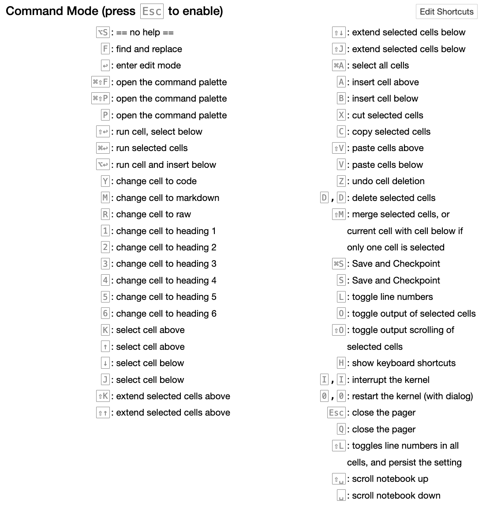
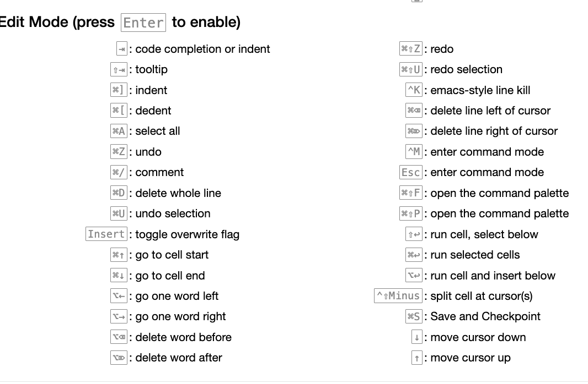

# Ipython & Jupyter Notebook

- [Ipython \& Jupyter Notebook](#ipython--jupyter-notebook)
  - [Ipython](#ipython)
    - [Advanced Features](#advanced-features)
  - [Jupyter Notebook](#jupyter-notebook)
    - [Keyboard Short-cuts](#keyboard-short-cuts)
    - [Magic Commands](#magic-commands)
    - [Jupyter Notebook Set-up](#jupyter-notebook-set-up)
    - [Install Jupyter Notebook](#install-jupyter-notebook)
      - [Use Jupyter-Contrib Extension](#use-jupyter-contrib-extension)
      - [Choose Theme](#choose-theme)
    - [Some Optoins for Jupyter Notebook](#some-optoins-for-jupyter-notebook)

## Ipython

- IPython is an enhanced interactive Python shell that provides a rich toolkit to help you work with Python more efficiently. It offers a more powerful and flexible environment than the default Python she
- IPython is closely tied with the Jupyter project, which provides a browser-based notebook that is useful for development, collaboration, sharing, and even publication of data science results

Some Key Features

- Interactive Shell:
  - Enhanced Read-Eval-Print Loop (REPL): IPython provides an enhanced REPL, which is more feature-rich compared to the standard Python shell.
  - Syntax Highlighting: It supports syntax highlighting, making code easier to read and debug.
  - Auto-completion: IPython offers powerful tab-completion for variables, functions, and modules.
  - Magic Commands: Special commands prefixed with % or %% to control the behavior of IPython and perform various tasks (e.g., %timeit, %run, %load_ext).
- Rich Media:
  - Display System: IPython can display rich media types like images, videos, LaTeX, and HTML.
  - Inline Matplotlib: It can display matplotlib plots inline within the shell.
- Parallel Computing:
  - IPython provides tools for parallel computing, allowing you to run code on multiple cores or machines.
- Integration with Jupyter:
  - IPython is the kernel for Jupyter notebooks, which provide a web-based interactive computing environment where you can combine code execution, text, mathematics, plots, and rich media into a single document.
- History and Logging:
  - IPython maintains a history of your commands and can log your sessions to a file.
- Shell Commands:
  - You can run shell commands directly from the IPython shell by prefixing them with !
- Debugging and Profiling:
  - IPython provides enhanced debugging and profiling tools.

Use Ipython


- Tab completion &lt;Tab&gt;
  - tab after command
  - object.&lt;tab&gt;
- introspection \(?\) operator after a variable \(object\)
  - ?? show more if possible
- Terminal Shortcuts
  - follow **Emacs*- keys and Linux shell keys
  - Ctrl + Shift + V paste from clipboard
- Command Line history
  - Ctrl + P \(Up\), Ctrl + N \(Down\) : previous or next history \(by %run\) 
  - \__ \_and \_\_ stored previous two commands,
    - \_&lt;n&gt; stores previous nth output
    - \_i&lt;n&gt; previous nth input
      - eval\(\_i27\)

### Advanced Features

- Ipython-Friendly Class
  - \_\__repr\_\_ _methods
- Profiles and [Configuration](https://www.google.com/search?q=create+ipython+config&oq=create+ipython+config&aqs=chrome..69i57j0l2.6031j0j4&sourceid=chrome&ie=UTF-8)
  - _.ipython/profile\_default/ipython\_config.py_
  - .jupyter/
  - ipython --profile=&lt;profile&gt;

## Jupyter Notebook

[Jupyter Notebook](https://jupyter.org/) is an web application for creating and sharing computational documents. It offers a simple, streamlined, document-centric experience.

> The notebooks documents are documents produced by the Jupyter Notebook App, which can contain both code (e.g. Python) and rich text elements (paragraphs, equations, links, etc..).
>
>The Jupyter Notebook App is a client-server application that allows editing and running notebook documents by a browser.

- Running on cloud alternatives
  - [Google Colab](https://colab.research.google.com/notebooks/welcome.ipynb#recent=true)
  - [Binder](https://gke.mybinder.org/)
- Local Run
  - [Install](https://jupyter.org/install.html)
  - [Run](https://jupyter.readthedocs.io/en/latest/running.html#running)
- [Config Jupyter](https://jupyter-notebook.readthedocs.io/en/stable/config_overview.html)
  - jupyter lab --config=...
  - jupyter notebook...

```shell
# install
pip install jupyter -i <source>
pip install jupyter lab

#launch
jupyter notebook
jupyter lab

```

### Keyboard Short-cuts

for Mac User:

- Ctrl: command key ⌘
- Shift: Shift ⇧
- Alt: option ⌥

Jupyter Notebook has two different keyboard input modes. Edit mode allows you to type code or text into a cell and is indicated by a green cell border. Command mode binds the keyboard to notebook level commands and is indicated by a grey cell border with a blue left margin.

Shortcuts:

- Ctrl + Shift + P: command ppalette
- Short Cuts in both command  (Esc to activate) & edit mode:
  - Shift + Enter run the current cell, select below
  - Ctrl + Enter run selected cells
  - Alt + Enter run the current cell, insert below
  - Ctrl + S save and checkpoint
- Command Mode
  - command mode (press Esc to activate):
    - Enter take you into edit mode
    - H show all shortcuts
    - Up select cell above
    - Down select cell below
    - A insert cell above
    - B insert cell below
    - X cut selected cells
    - C copy selected cells
    - V paste cells below
    - Shift + V paste cells above
    - D, D (press the key twice) delete selected cells
    - Z undo cell deletion
    - S Save and Checkpoint
    - Y change the cell type to Code
    - M change the cell type to Markdown
    - P open the command palette.
    - Shift + Space scroll notebook up
    - Space scroll notebook down
    - Shift + Tab will show you the Docstring (documentation) for the the object you have just typed in a code cell 
      - you can keep pressing this short cut to cycle through a few modes of documentation.
    - Ctrl + Shift + - will split the current cell into two from where your cursor is.
    - Esc + F Find and replace on your code but not the outputs.
    - Esc + O Toggle cell output.
    - Select Multiple Cells:
      - Shift + Up extend selected cells above
      - Shift + Down extend selected cells below
      - Shift + J or Shift + Down selects the next sell in a downwards direction. You can also select sells in an upwards direction by using Shift + K or Shift + Up.
        - Once cells are selected, you can then delete / copy / cut / paste / run them as a batch. This is helpful when you need to move parts of a notebook.
You can also use Shift + M to merge multiple cells.
- Edit mode
  - sc take you into command mode
  - Tab code completion or indent
  - Shift + Tab tooltip
  - Ctrl + ] indent
  - Ctrl + [ dedent
  - Ctrl + A select all
  - Ctrl + Z undo
  - Ctrl + Shift + Z or Ctrl + Y redo
  - Ctrl + Home go to cell start
  - Ctrl + End go to cell end
  - Ctrl + Left go one word left
  - Ctrl + Right go one word right
  - Ctrl + Shift + P open the command palette
  - Down move cursor down
  - Up move cursor up

Full list of shortcuts:

- Mac OS:
  - 
  - 

### [Magic Commands](https://ipython.readthedocs.io/en/stable/interactive/magics.html)

To view a list of all available magic commands, simply run the following code in a cell:

```bash
%lsmagic
```

Some of most useful ones

- %env: set environment variables
  - When working with certain libraries in Jupyter Notebook, such as Theano, you may need to set environment variables to control their behavior. Instead of restarting the Jupyter server process each time you need to modify an environment variable, you can use the %env magic command to manage them directly within the notebook.
- %run: execute scripts
  - parameters
    - - -d use debugger
      - c\(continue\), s\(step\)
      - !&lt;var&gt; to view variables
      - [debugger commands](https://docs.python.org/2.0/lib/debugger-commands.html)
    - -p 
  - %prun - Execute with c profile statement
    - %paste, %cpaste
    - %%prun - profile code block
  - %lprun - line profiler
    - uses line\_profiler
    - %lprun -f func1 -f func2 &lt;statement to profile&gt;
- %load: insert code from External Scripts (will replace the code in current cell)
  - parameters sanme as %run 
- %store: pass variables between notebooks
  - can del \<variable\> from current name space
- %who, , who\_ls whos: list global variables in the notebook
  - who [data_type]: list cetetain type of variables 
- %time and %timeit: time running time
-  %xdel &lt;variable&gt;
   - %reset - delete all variables
- %config: configuration
- %page Object: pretty print object
- %pdb: debug with pdb-When an exception is raised, Jupyter will automatically enter the debugger, allowing you to use pdb commands to navigate through your code, inspect variables, and identify the cause of the exception. Some common pdb commands include:
  - n (next): Execute the next line
  - s (step): Step into a function call
  - c (continue): Continue execution until the next breakpoint or exception
  - p (print): Print the value of an expression
  - q (quit): Quit the debugger
  
command line ones

- !&lt;cmd&gt;
  - cmd in system shell
  - can combine with current python variables with $
    - ```py
      foo = 'test*' # wildcard
      !ls $foo
      ```
- %alias &lt;alias\_name&gt; &lt;cmd&gt;
  - give command alias
- %pwd
- %bookmark &lt;name&gt; &lt;dir&gt;
  - -b: override and use bookmark location
  - -l: list all bookmarks
- %cd
  - %pushd, %popd
- %dirs
- %ddhist
  - history of visited directories
- %env
  - environmental variables

for Matplotlib

- %matplotlib: configure matplotlib options
  - %matplotlib inline

### Jupyter Notebook Set-up

### Install [Jupyter Notebook](https://test-jupyter.readthedocs.io/en/latest/install.html)

```bash
conda install jupyter
```

#### Use Jupyter-Contrib Extension

Jupyter-contrib extensions is a family of extensions which give Jupyter a lot more functionality, including e.g. jupyter spell-checker and code-formatter.

The following commands will install the extensions, as well as a menu based configurator that will help you browse and enable the extensions from the main Jupyter notebook screen.

```py
!pip install https://github.com/ipython-contrib/jupyter_contrib_nbextensions/tarball/master !pip install jupyter_nbextensions_configurator !jupyter contrib nbextension install --user !jupyter nbextensions_configurator enable --user

```

Some of the most useful ones

- Table of Contents (2)
- Nbextensions Configurator: default open
- Codefolding
- Collapsible Headings
- Variable Inspector
- ExecuteTime
- Spellchecker
- Scratchpad
- Highlight Selected Word
- Hide Input All

#### Choose Theme

Set-up

```bash
pip install  jupyterthemes -i <https://pypi.tuna.tsinghua.edu.cn/simple>

# reference : https://bbs.huaweicloud.com/blogs/314114>

jt -t gruvboxd -fs 11 -cellw 85% -ofs 12 -dfs 11 -T

#jt -l 可以看所有可用主题

# 扩展功能：
pip install jupyter_contrib_nbextensions -i <https://pypi.tuna.tsinghua.edu.cn/simple>
jupyter contrib nbextension install --sys-prefix

```

use [config](https://jupyter-notebook.readthedocs.io/en/5.7.4/config.html)

```bash
# Defaults for these options can also be set by creating a file named jupyter_notebook_config.py in your Jupyter folder. The Jupyter folder is in your home directory, ~/.jupyter.

jupyter notebook --generate-config

```

change the following lines in config when using linux

```plaintext
c.NotebookApp.iopub_data_rate_limit = 1000000000
c.NotebookApp.ip = "*"
# on remote machine
c.NotebookApp.open_browser=False
# change to a separate file
c.NotebookApp.notebook_dir = 'home/liuxinhe.x/jupyter
```


### Some Optoins for Jupyter Notebook

To run different kernels in a notebook : use %%

```text
%%bash for Bash shell scripts
%%HTML for HTML code
%%python2 for Python 2
%%python3 for Python 3
%%ruby for Ruby
%%perl for Perl
%%r for r 
```


To show all Outputs

```py
from IPython.core.interactiveshell import InteractiveShell
InteractiveShell.ast_node_interactivity = "all"
```

or add to ~/.ipython/profile_default/ipython_config.py with the following lines:

```py
c = get_config()
# Run all nodes interactively
c.InteractiveShell.ast_node_interactivity = "all"
```

Plot high-resolution graph: InlineBackend.figure_format configuration option to 'retina', Matplotlib will generate plots with double the resolution, resulting in sharper and more detailed images on compatible displays

```
%%config InlineBackend.figure_format ='retina'
```

Install Other Kernels for Jupyter notebook: Use Conda

```bash
# use conda
conda install -c r r-essentials
```

Run Python and R in the same note boook

```
pip install rpy2
```

```py
%%py rpy2.ipython

```
further reading 

- https://www.jianshu.com/p/21ba32a057c4
- [Notebook 7](https://jupyter-notebook.readthedocs.io/en/latest/migrate_to_notebook7.html)
- https://www.dataquest.io/blog/jupyter-notebook-tips-tricks-shortcuts/